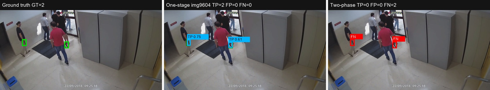
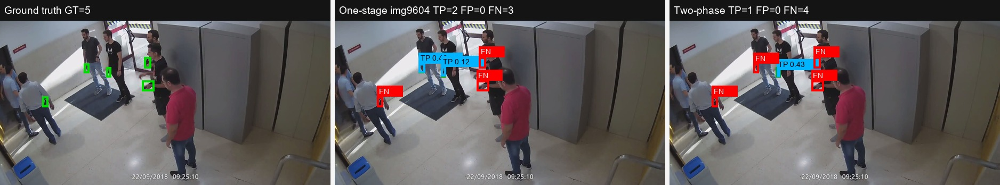
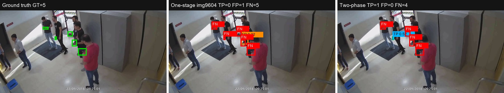
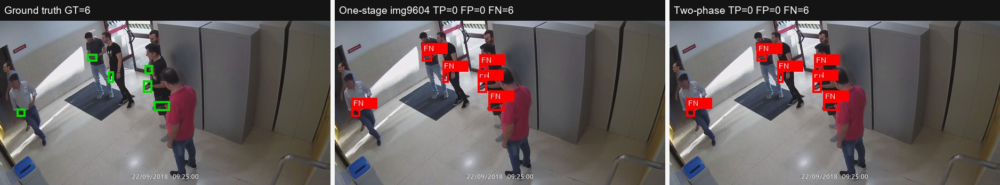
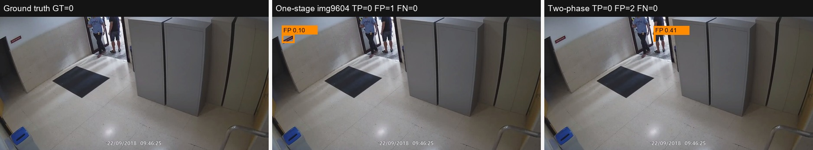

# Sprint 5 - One-Stage vs Two-Phase Visual Examples

These examples compare the final Sprint 5 one-stage detector against the available two-phase pipeline outputs on the same Cam5 test frames.

Settings used for the visual comparison:

- one-stage: `runs/single_stage/yolo26n_img9604/weights/best.pt`, visualized at confidence threshold `0.10` using saved predictions
- two-phase: `runs/two_phase/predictions/test_predictions.csv`, current checkpoint threshold from the saved pipeline summary
- matching IoU: `0.50`

Legend: green = ground truth, cyan = true positive, orange = false positive, red = false negative.

## One Stage Wins

One-stage detects weapons that the two-phase pipeline misses.

Image: `Cam5-From09-24-18To09-26-43-Guns_x264_Segment_0_x264_frame_120`

| GT | One-stage TP | One-stage FP | One-stage FN | Two-phase TP | Two-phase FP | Two-phase FN |
|---:|---:|---:|---:|---:|---:|---:|
| 2 | 2 | 0 | 0 | 0 | 0 | 2 |

## Both Detect

Both methods detect at least one weapon, but error profiles differ.

Image: `Cam5-From09-24-18To09-26-43-Guns_x264_Segment_0_x264_frame_104`

| GT | One-stage TP | One-stage FP | One-stage FN | Two-phase TP | Two-phase FP | Two-phase FN |
|---:|---:|---:|---:|---:|---:|---:|
| 5 | 2 | 0 | 3 | 1 | 0 | 4 |

## Two Phase Only

Two-phase finds a weapon missed by one-stage.

Image: `Cam5-From09-24-18To09-26-43-Guns_x264_Segment_0_x264_frame_85`

| GT | One-stage TP | One-stage FP | One-stage FN | Two-phase TP | Two-phase FP | Two-phase FN |
|---:|---:|---:|---:|---:|---:|---:|
| 5 | 0 | 1 | 5 | 1 | 0 | 4 |

## Both Miss

Both methods miss difficult or occluded weapons.

Image: `Cam5-From09-24-18To09-26-43-Guns_x264_Segment_0_x264_frame_83`

| GT | One-stage TP | One-stage FP | One-stage FN | Two-phase TP | Two-phase FP | Two-phase FN |
|---:|---:|---:|---:|---:|---:|---:|
| 6 | 0 | 0 | 6 | 0 | 0 | 6 |

## False Positive

False-positive behavior on a frame without ground-truth weapons.

Image: `Cam5-From09-46-24To09-47-02_x264_frame_3`

| GT | One-stage TP | One-stage FP | One-stage FN | Two-phase TP | Two-phase FP | Two-phase FN |
|---:|---:|---:|---:|---:|---:|---:|
| 0 | 0 | 1 | 0 | 0 | 2 | 0 |

