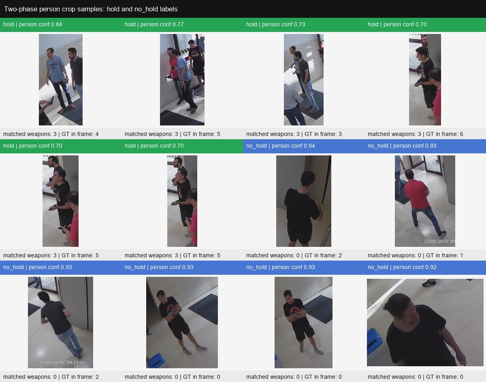
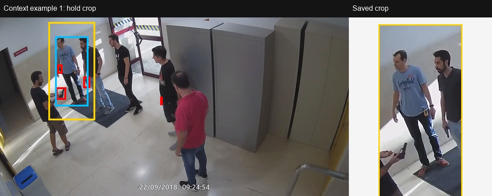
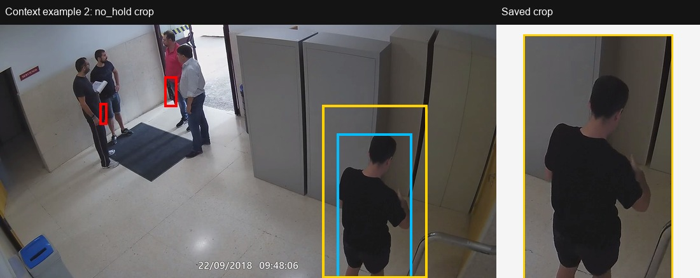
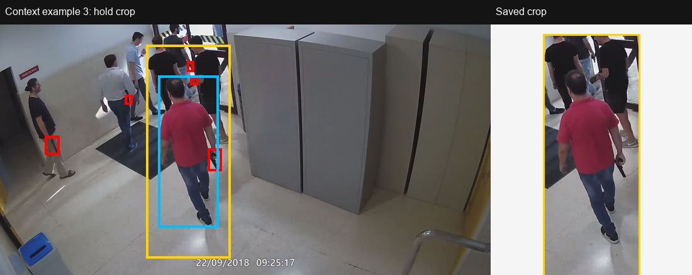
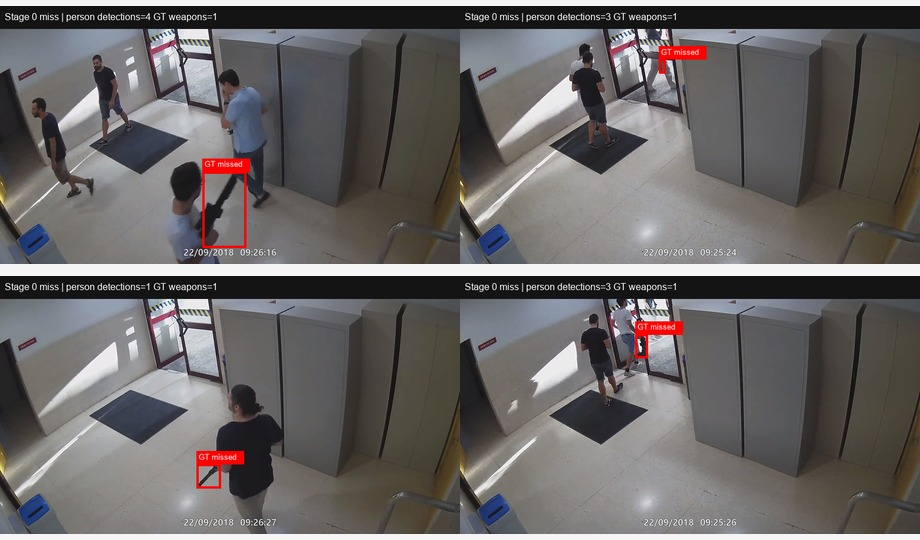

# Sprint 5 - Two-Phase Person Crop Quality Check

This page inspects the person crops produced by `scripts/build_two_phase_dataset.py` using already saved artifacts. No model was rerun to create these figures.

Color legend for context figures:

- red: ground-truth weapon boxes
- cyan: detected person box
- yellow: padded crop saved to disk

## Crop Samples

The crop sheet mixes `hold` and `no_hold` examples from the test split.

## Crop Context Examples

## Stage 0 Miss Examples

These frames contain ground-truth weapons, but the detected person boxes did not contain the weapon center, so the two-phase pipeline cannot recover those weapons later.

## Interpretation

The crops are generally reasonable for centered people, and the padding helps preserve context around hands. However, the quality check also shows why the two-phase pipeline is fragile: if the person detector crop misses the hand/weapon area, or if the weapon center falls outside the detected person box, the later weapon detector never receives a useful crop.